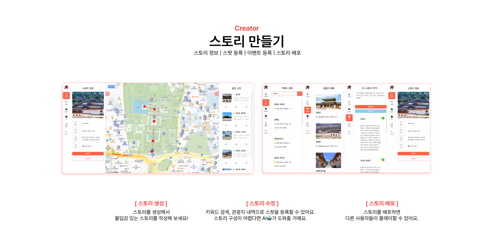

# 여행에 이야기를 더하다, KETCHUP-NOW 🍅

  

## 📅 프로젝트 정보

### SSAFY 11기 1학기 관통 프로젝트

**✨ 관통 프로젝트 최우수상 (반 1등) ✨**

2024.04.30(화) ~ 2024.05.24(금) [4주]

 

## 📖 주제

여행에 게이미피케이션 요소를 더한 **도보 여행 스토리 제작 서비스**

'여행에 이야기를 더하다'라는 테마로 따라잡는다는 뜻의 catch up에서 따와 **KETCHUP, NOW**를 만들었어요.

장소의 이야기를 통해 책 속 주인공이 되어 따라잡는 경험을 제공하여, 여행자가 더욱 스토리에 몰입할 수 있도록 했어요.

 

## 🍅 서비스 소개

> 프로젝트에 대한 이야기나 시연 영상은 [블로그](https://allkong.tistory.com/64)에서 확인할 수 있어요.

 

Desktop에서는 **크리에이터** 시점으로, 
Mobile에서는 **플레이어** 시점으로 서비스를 이용할 수 있어요. 

크리에이터가 스토리를 만들면 플레이어가 스토리를 플레이해요.

 

### 1. 크리에이터 (desktop)

크리에이터 시점은 스토리를 관리 및 생성해야 해서 화면이 복잡하기 때문에 desktop에서 이용 가능해요.

- **메인화면**
  - 로그인, 회원가입
- **스토리 목록**
  - 스토리 조회, 스토리 생성
- **스토리 수정**
  - 스토리 정보 수정, 키워드 검색, 관광지 조회, 스팟 등록, AI 스토리 작가, 배포

 

### 2. 플레이어 (mobile)

- **검색 탭**
  - 스토리 목록, 스토리 상세 조회, 스토리 찜하기
- **찜 탭**
  - 스토리 찜 목록 조회, 스토리 찜 삭제, 스토리 상세 조회로 이동
- **플레이 탭**
  - 플레이 중인 스토리 참여, 현 위치 조회, 스팟 이벤트 진행, 스토리 포기, 모든 스팟 이벤트 클리어 시 스토리 클리어, 리뷰 작성
- **기록 탭**
  - 플레이 완료한 스토리 목록 조회, 플레이 완료한 스토리 상세 조회(플레이 기록 조회)
- **MY 탭**
  - 사용자 정보 조회 및 수정, 리뷰 수정 및 삭제

 

## 🔎 기술 스택

> Frontend

  
  
  

  
  

 

> Backend

  
  

  
  
  
  

 

## 🗃️ 아키텍처

 

## 🎨 와이어프레임

 

## 😎 팀원

<table>
  <tr>
    <th>박유빈 👑</th>
    <th>정다빈</th>
  </tr>
  <tr>
    <td></td>
    <td></td>
  </tr>
  <tr align=center>
    <td><a href="https://github.com/pcjs156">@pcjs156</a></td>
    <td><a href="https://github.com/allkong">@allkong</a></td>
  </tr>
  <tr>
    <td>
      <ul">
        <li>Backend 메인 개발</li>
        <li>Frontend 서브 개발</li>
      </ul>
    </td>
    <td>
      <ul>
        <li>Frontend 메인 개발</li>
        <li>UI/UX 디자인 총괄</li>
      </ul>
    </td>
  </tr>
</table>
